# C046 – King Kids Child Development & Therapy Management System

## Demo User Guide

This guide explains the functions available in the current KING KIDS frontend demo. It uses fictional child and staff information. The demo supports development planning, therapy coordination, progress review and parent-facing reporting; it does not provide real login, a backend database, medical diagnosis, payment processing, messaging delivery or file uploads.

## 1. System overview

The demo is centred on each child’s development journey. Staff can open a child, review the development profile, update skills and goals, record sessions, track attendance, review observations and prepare reports. A parent-facing role shows a simplified view of one child and only notes approved for sharing.

## 2. How the system works

1. Open an existing child from **Children**.
2. Review the child’s **Development Profile** and update a skill stage when appropriate.
3. Update the **Individual Development Plan** and create or update development goals.
4. Record a **Therapy Session** or schedule a future session.
5. Add an observational **Assessment**, attendance status or a parent communication log when needed.
6. Use **Progress Tracking** to compare baseline and current development.
7. Review the case with the team and generate a **Progress Report**.

The demo begins with seeded children and staff. It does not include a child-registration form.

## 3. Main modules

### Dashboard

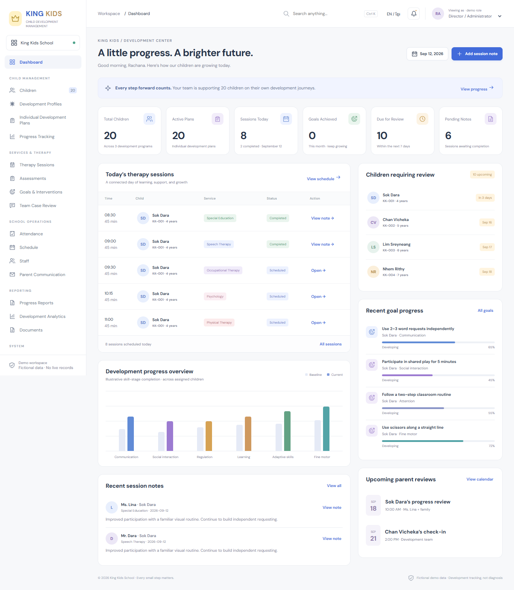

**Purpose:** Gives the team a quick overview of activity and development progress.

**Main functions:** Total children, active plans, sessions today, achieved goals, children due for review, pending notes, session list, recent goal progress, development overview, recent notes and upcoming parent reviews.

**Typical use:** A director starts here to see today’s sessions and follow up on review dates or incomplete notes.

**Who uses it:** Director sees all fictional data; teacher and therapist views are limited to their seeded scope.

### Children

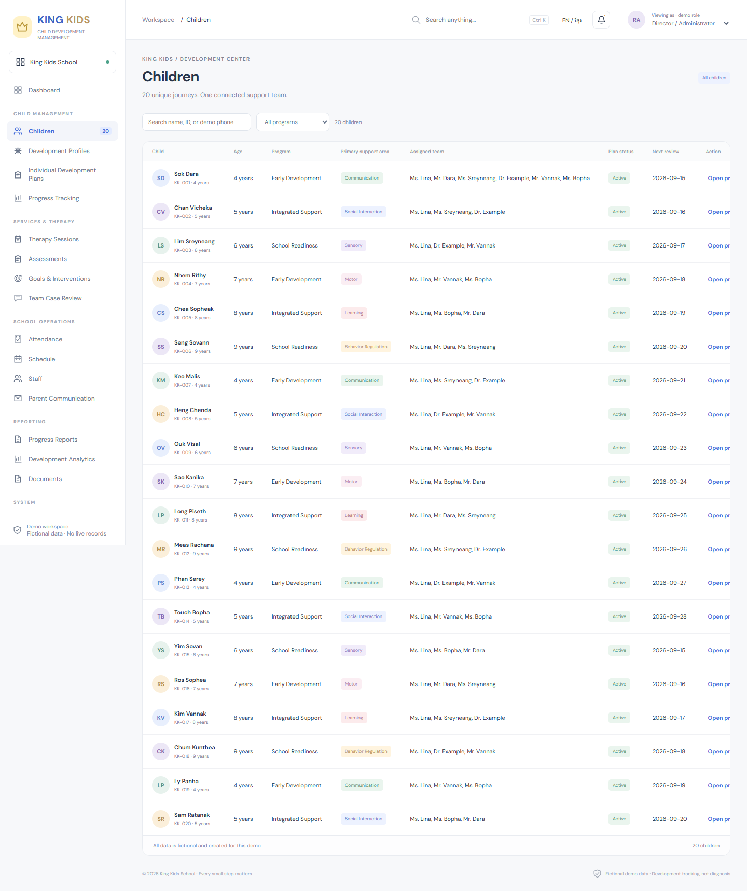

**Purpose:** Lists the fictional children included in the demo.

**Main functions:** View child ID, age, program, primary support area, assigned team, plan status and next review. Search by child name, child ID or fictional phone reference; filter by program.

**Typical use:** Find a child, then choose **Open profile**.

**Who uses it:** Director sees 20 seeded children. Specialist and teacher views show their seeded assigned-child scope. Parent View does not show this list.

### Child Profile

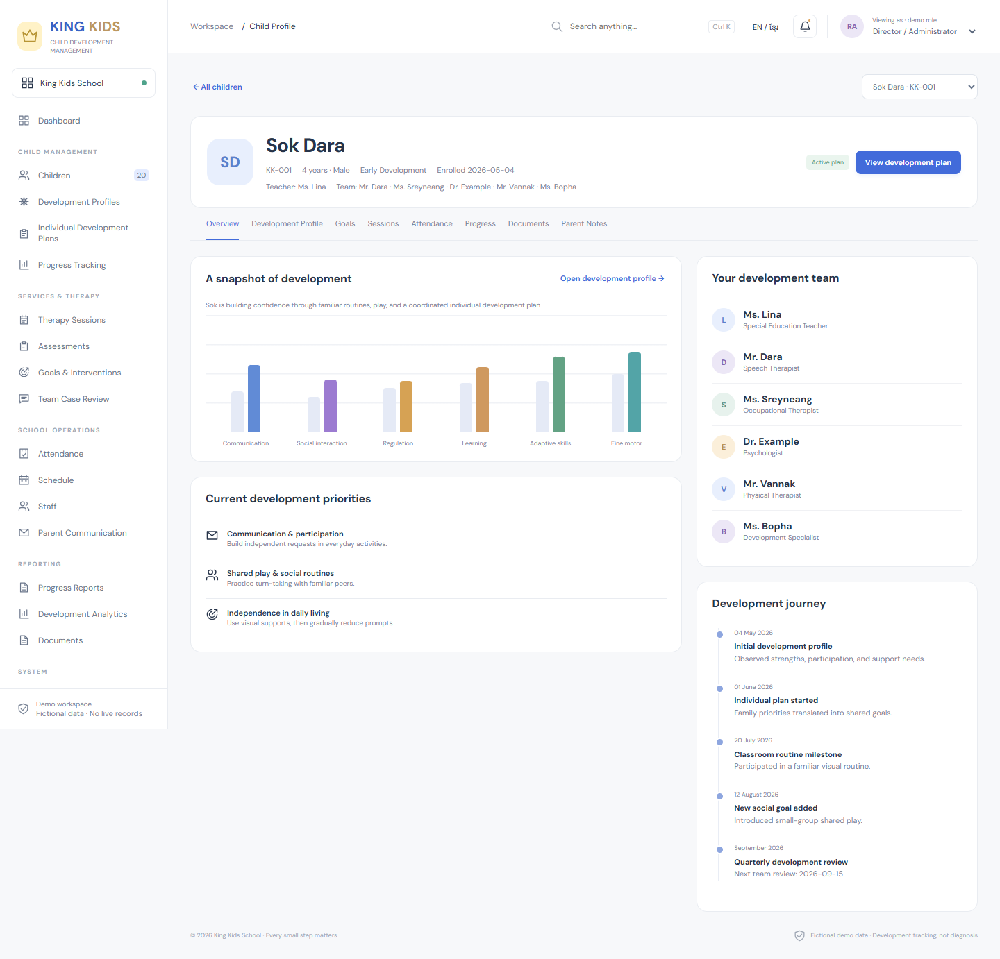

**Purpose:** Brings a child’s current information and development journey into one workspace.

**Main functions:** Overview, Development Profile, Goals, Sessions, Attendance, Progress, Documents and Parent Notes tabs. Shows basic fictional details, program, team and plan status.

**Typical use:** Open this page before reviewing or updating the child’s development work.

**Note:** The demo shows child information but has no add/edit child-information form.

### Development Profiles

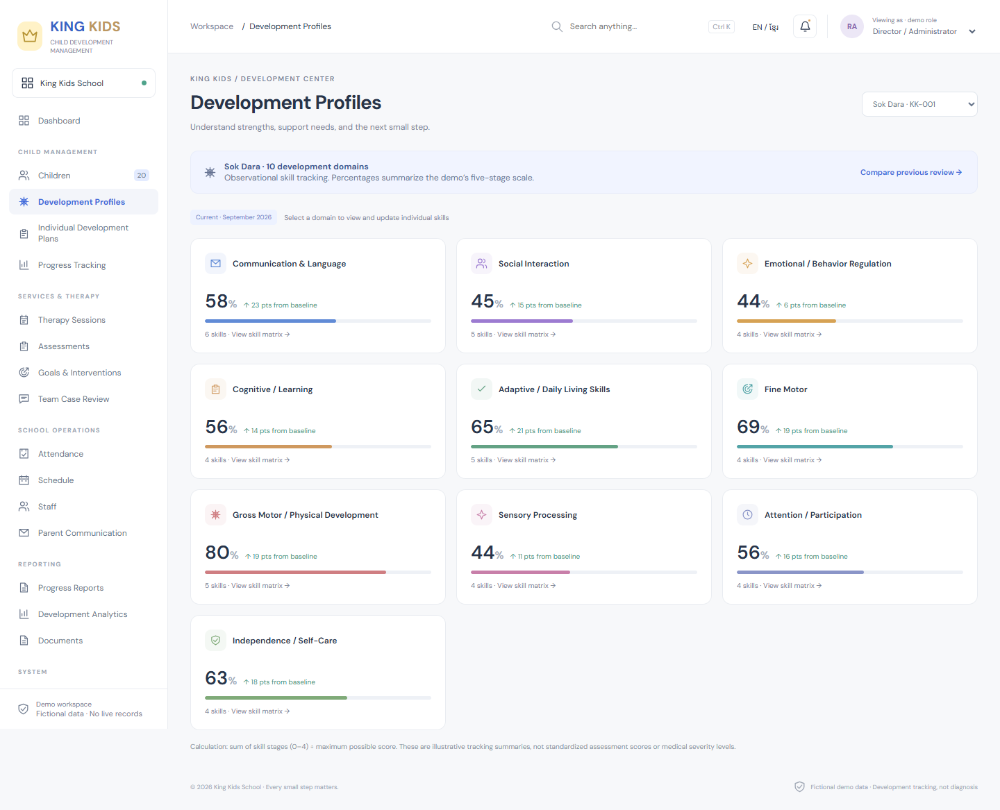

**Purpose:** Records observable development skills across ten domains.

**Main functions:** Select a child; compare the fictional baseline and current review; open a domain; change an individual skill to Not Started, Emerging, Developing, Achieved or Generalized.

**Domains:** Communication & Language; Social Interaction; Emotional / Behavior Regulation; Cognitive / Learning; Adaptive / Daily Living Skills; Fine Motor; Gross Motor / Physical Development; Sensory Processing; Attention / Participation; Independence / Self-Care.

**Typical use:** Open Communication & Language and update a skill stage after observation. Current percentage summaries refresh from the saved skill stages.

**Important:** These are progress-tracking stages, not medical severity levels or diagnostic scores.

### Individual Development Plans

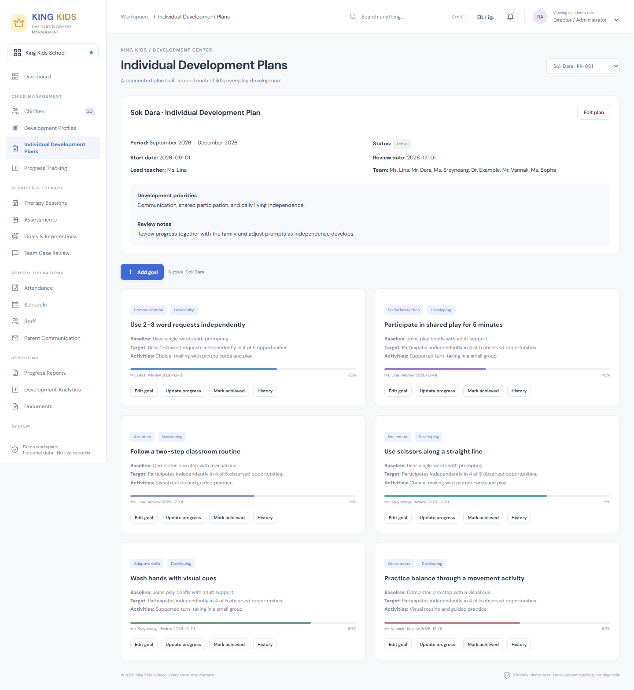

**Purpose:** Keeps development priorities, review dates and goals together for one child.

**Main functions:** View or edit period, start date, review date, priorities and review notes; then add or manage goals below the plan.

**Typical use:** Set priorities for the plan period, then add the goals that the team will work toward.

**Note:** The demo keeps one editable plan object per child and displays it as Active.

### Progress Tracking

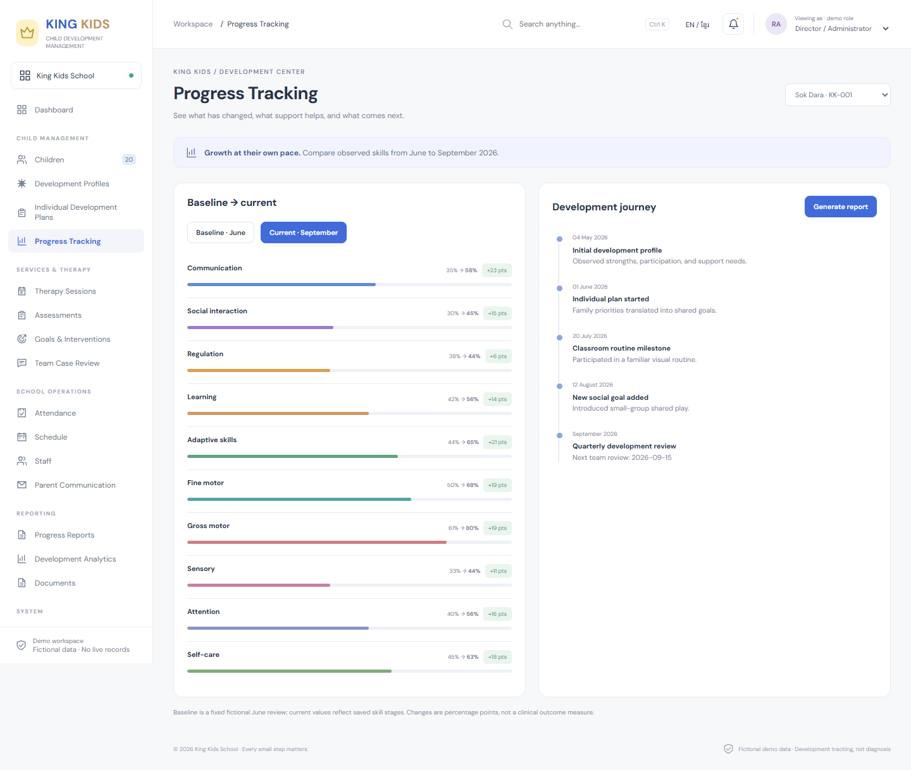

**Purpose:** Makes changes over time easy to review.

**Main functions:** Baseline June / Current September toggle; domain-by-domain percentage comparison; fictional development journey timeline; Generate report shortcut.

**Typical use:** Review current progress before a parent or team meeting.

**Note:** Baseline values are seeded fictional values. Current values reflect saved skill stages.

### Therapy Sessions

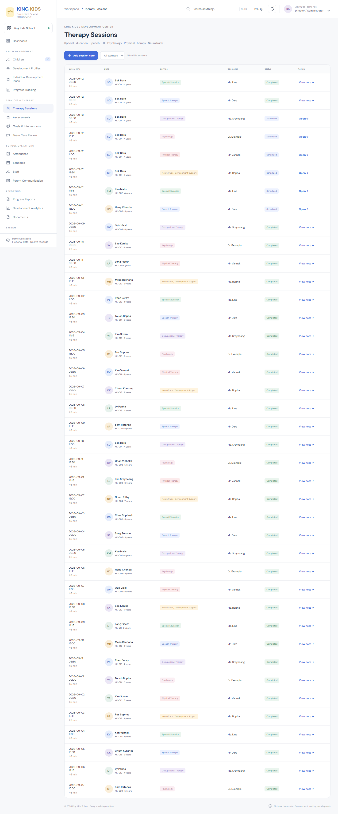

**Purpose:** Records Special Education and therapy work for each session.

**Main functions:** Add or edit a session; select child, specialist, service, date/time, duration and status; record goals, activities, child response, assistance, notes, home recommendation, evidence label and next session. Filter by Scheduled, Completed or Cancelled.

**Services shown:** Special Education, Speech Therapy, Occupational Therapy, Psychology, Physical Therapy and NeuroTrack / Development Support.

**Typical use:** Complete a session note after the session and select parent approval only when the note may appear in Parent View.

### Assessments

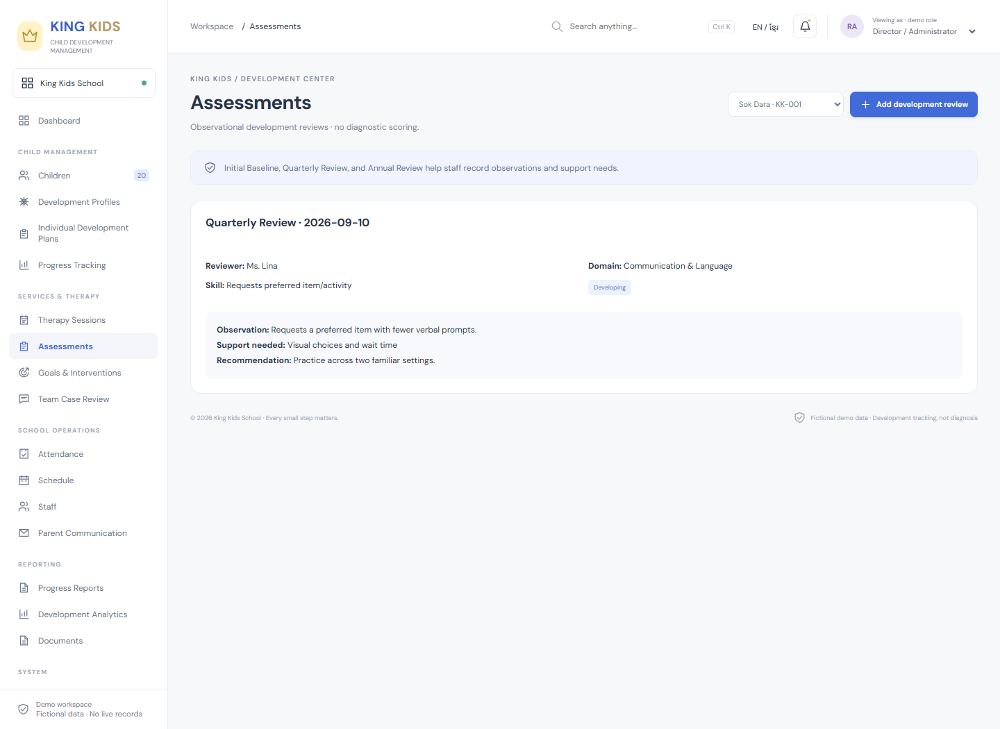

**Purpose:** Stores observational development reviews without diagnostic scoring.

**Main functions:** Add Initial Baseline, Quarterly Review or Annual Review; select reviewer, domain, skill, current level, observation, support needed and recommendation.

**Typical use:** Save an observation during a planned review. The saved level updates the current skill stage for that selected item.

### Goals and Interventions

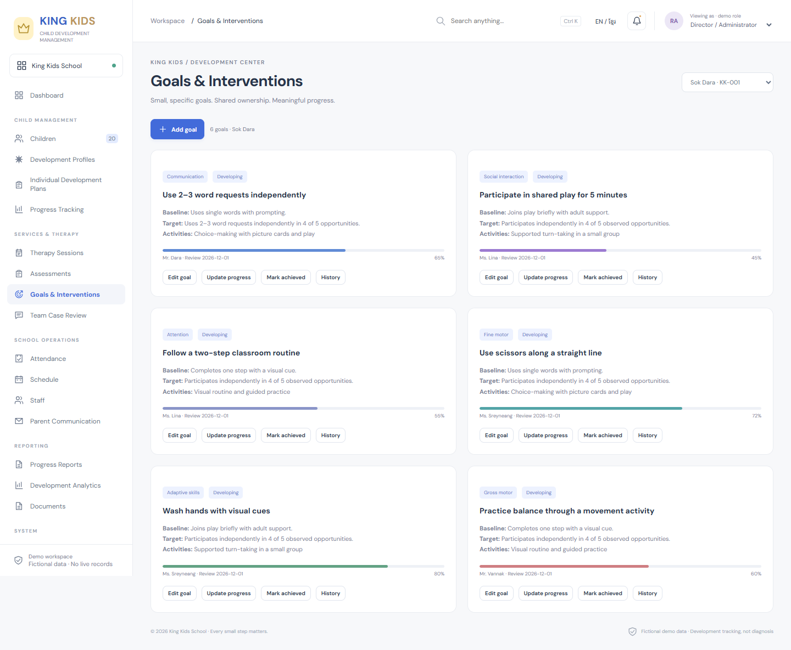

**Purpose:** Manages specific development goals and their progress.

**Main functions:** Add/edit a goal; select domain and responsible staff; record baseline, target, activities, dates, percentage and stage; update progress; mark achieved; view history.

**Typical use:** Create an observable goal, then add a short progress observation after relevant sessions.

**Note:** Marking a goal Achieved changes its progress to 100% in the demo.

### Team Case Review

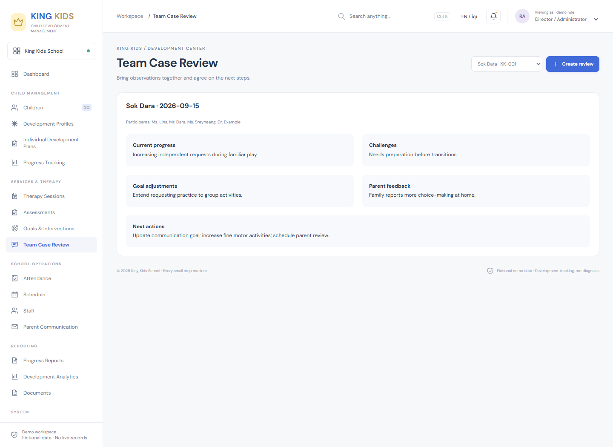

**Purpose:** Keeps multidisciplinary discussion about one child together.

**Main functions:** Create a review with meeting date, participants, current progress, challenges, goal adjustments, parent feedback and next actions.

**Typical use:** Record agreed actions after a team meeting.

### Attendance

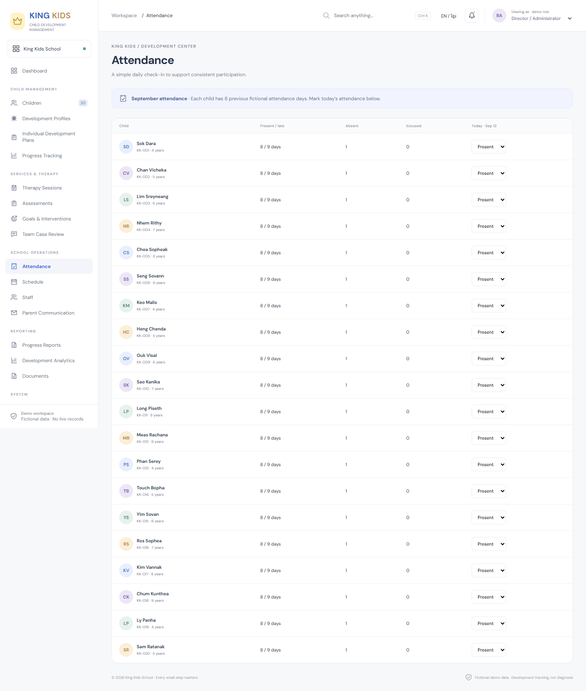

**Purpose:** Records a simple attendance status for the current demo day.

**Main functions:** Select Present, Absent, Late or Excused for each visible child; view an illustrative September summary.

**Typical use:** Mark today’s attendance before sessions begin.

**Note:** The previous attendance totals are fictional; the demo is not a dated attendance ledger.

### Schedule

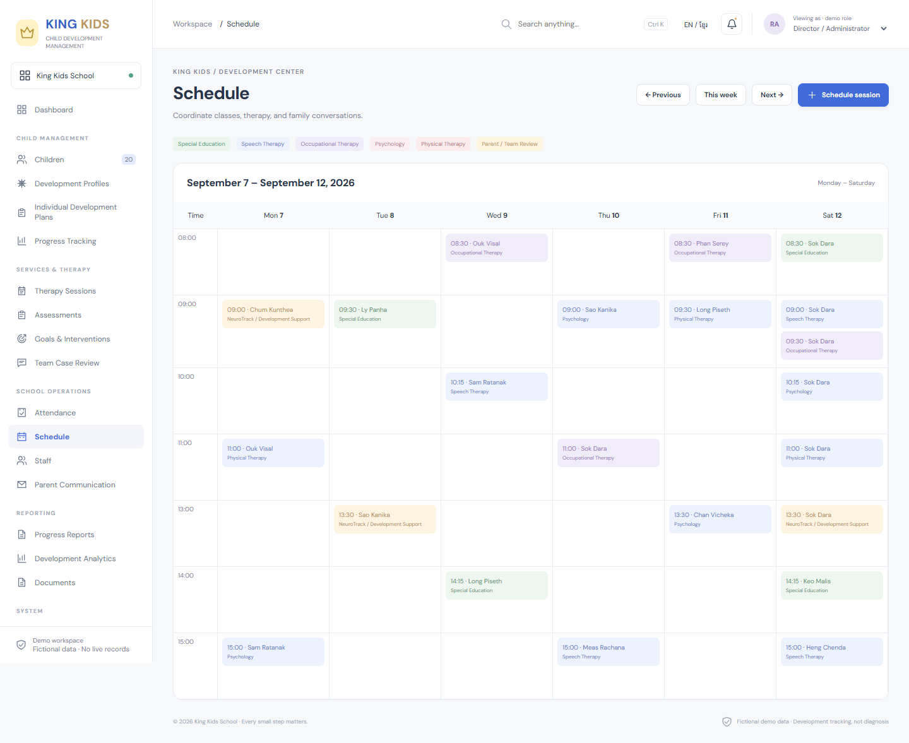

**Purpose:** Shows a weekly view of therapy, education and review activities.

**Main functions:** Move to the previous/next week or current week; schedule a session; open session details; view color-coded service entries and sample parent/team reviews.

**Typical use:** Check the week’s sessions before adding or completing session notes.

**Note:** The demo does not check recurring appointments or schedule conflicts.

### Staff

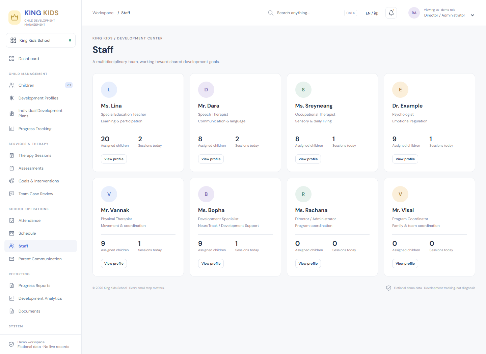

**Purpose:** Shows the fictional multidisciplinary team.

**Main functions:** View name, role, specialty, assigned-child count, sessions today and upcoming scheduled sessions.

**Typical use:** Open a staff profile to review their demo workload.

**Note:** Staff records and assignments are read-only in this demo.

### Parent Communication

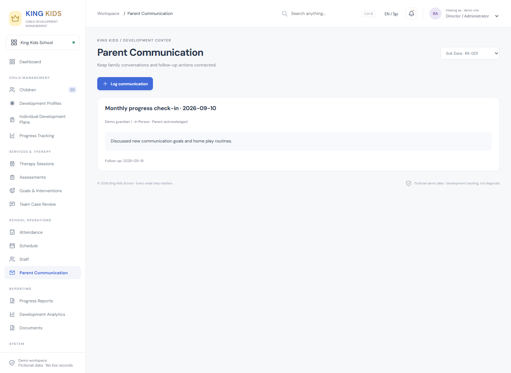

**Purpose:** Keeps a simple record of family contact.

**Main functions:** Add a contact log with guardian, date, Phone/Telegram/In Person method, reason, notes, follow-up date and acknowledgement status.

**Typical use:** Add a note after a progress check-in or family conversation.

**Note:** The choices are log labels only. The demo does not send calls, Telegram messages, email or SMS.

### Progress Reports

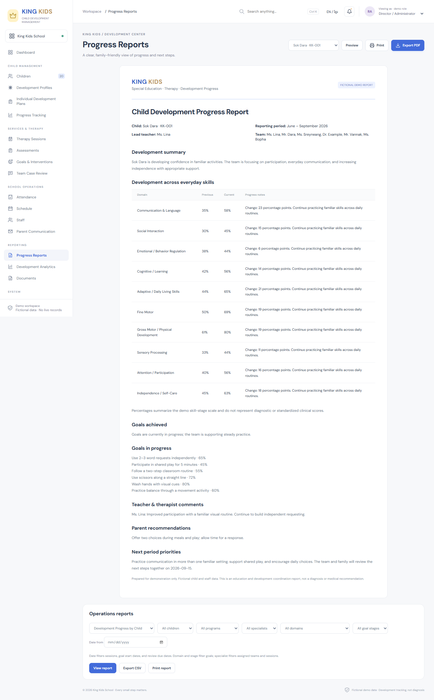

**Purpose:** Creates a parent-friendly progress summary and operational report views.

**Child Development Progress Report:** Shows child/team details, development summary, previous/current domain values, goals achieved, goals in progress, approved teacher/therapist comments, recommendations and next priorities.

**Main functions:** Preview; Print; Export PDF guidance through browser Print → Save as PDF.

**Operations reports:** Development Progress by Child, Development Progress by Domain, Goals Status, Sessions by Service, Attendance, Children Due for Review and Therapist Workload.

**Filters:** Child, program, specialist, domain, goal stage and date from. Filters apply where relevant to the selected report.

**Export:** Operations reports provide View report, Export CSV and Print report. The child report does not have a direct CSV export.

### Development Analytics

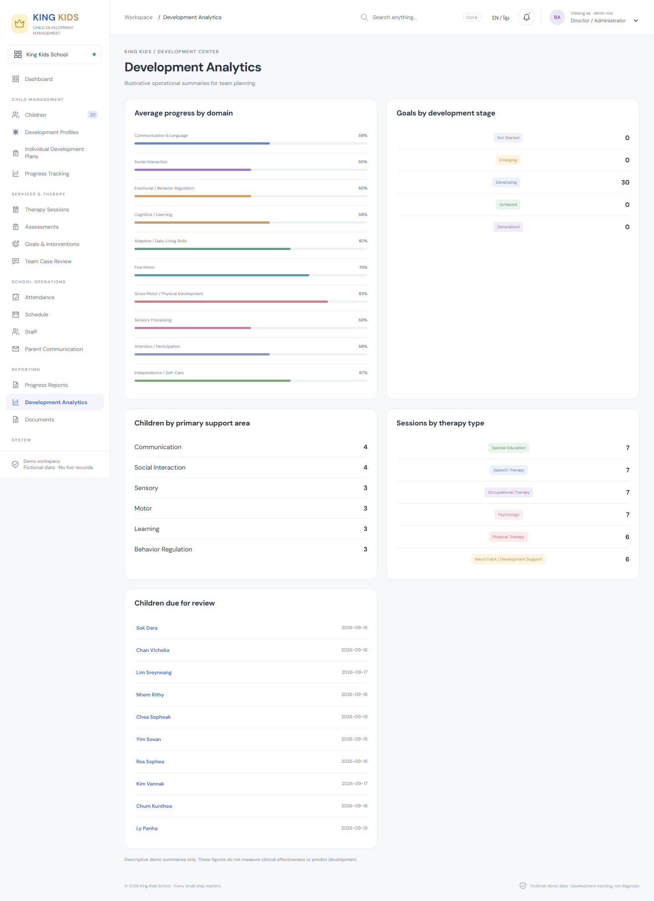

**Purpose:** Summarizes fictional operational and development data for management.

**Main functions:** Average progress by domain, goals by stage, children by primary support area, sessions by service and children due for review.

**Typical use:** Look for areas that may need team attention before a review meeting.

**Note:** This page is available to the Director demo role. It has no export control.

### Documents

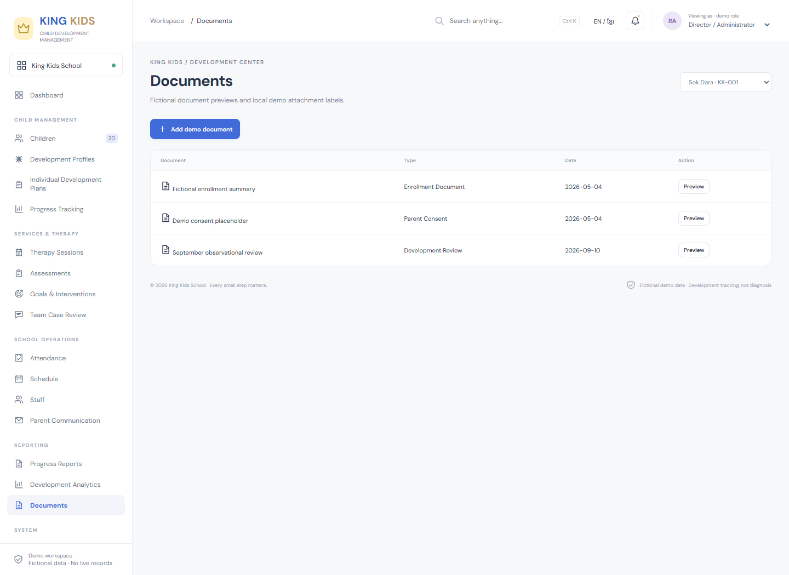

**Purpose:** Organizes fictional document references for a child.

**Main functions:** Add a document title, type, date and demo text; preview saved entries. Types include enrollment document, development review, progress report, therapy note, parent consent and Other.

**Typical use:** Record where a relevant document would be listed for the child.

**Note:** No actual files are uploaded, stored or downloaded.

### Users and Roles

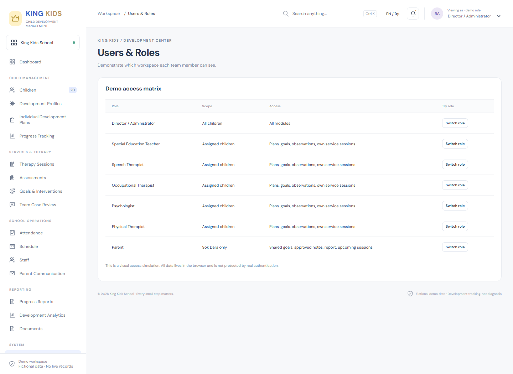

**Purpose:** Demonstrates the scope of each role in the interface.

**Main functions:** View the access matrix and switch the current demonstration role.

**Typical use:** Change role before demonstrating the staff or parent experience.

**Note:** This is a visual role simulation. It does not create user accounts or provide real authentication.

### Activity Log

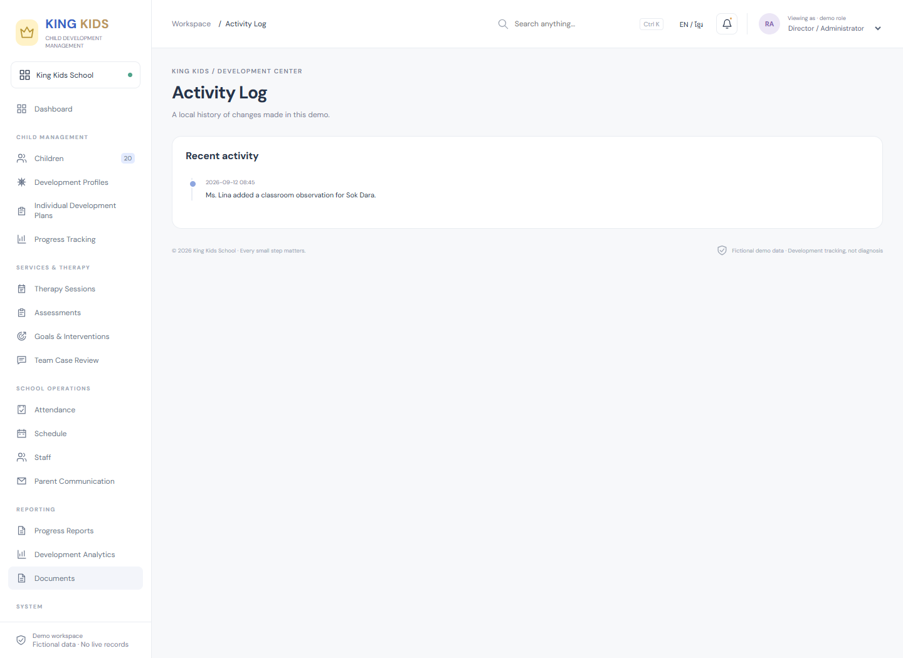

**Purpose:** Shows recent changes made in this browser demo.

**Main functions:** View the latest locally saved activity entries.

**Typical use:** See a simple history of recent demo actions.

**Note:** It is not a secure, multi-user audit trail.

### Settings

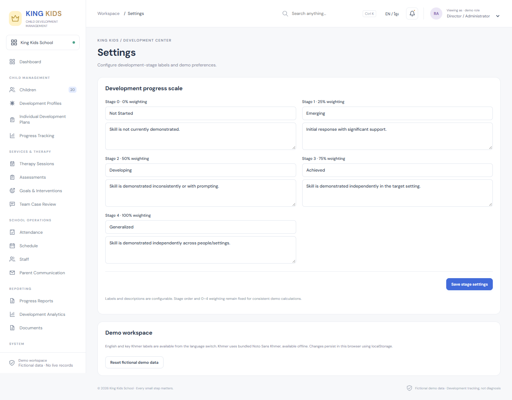

**Purpose:** Configures the language and descriptions of the progress-stage scale for the demonstration.

**Main functions:** Edit the five stage names and descriptions; reset fictional demo data after confirmation; use the top-bar switch for English/key Khmer labels.

**Typical use:** Adjust language labels for a presentation or restore the starting data after a demo.

**Note:** Stage order and weighting remain fixed. Reset removes saved local demo edits.

### Parent View

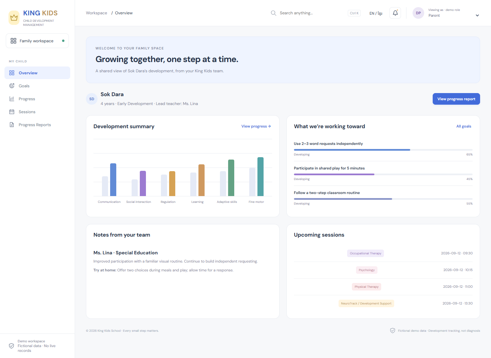

**Purpose:** Gives a simplified family-facing view of one fictional child.

**Main functions:** View Development Summary, Goals, Progress, Sessions and Progress Reports; see approved team notes, home recommendations and upcoming sessions.

**Typical use:** Switch to Parent role to demonstrate what a family may see.

**Note:** Parent View is fixed to Sok Dara in the demo. It has no editing controls and hides unapproved note contents.

## 4. Role-based guides

### Confirmed roles

The system contains seven selectable demo roles:

1. Director / Administrator
2. Special Education Teacher
3. Speech Therapist
4. Occupational Therapist
5. Psychologist
6. Physical Therapist
7. Parent

There is no separately named Founder, generic Staff or child/student role. There is also no real login: the role selector changes the visible demonstration workspace.

### A. Director / Administrator guide

**Role purpose:** Oversees the whole fictional centre view.

**Dashboard and navigation:** All 19 primary modules are visible: Dashboard; Children; Development Profiles; Individual Development Plans; Progress Tracking; Therapy Sessions; Assessments; Goals & Interventions; Team Case Review; Attendance; Schedule; Staff; Parent Communication; Progress Reports; Development Analytics; Documents; Users & Roles; Activity Log; Settings.

**Daily tasks:** Review dashboard counts and upcoming reviews; open any child; update plans, skills, goals, sessions, assessments, attendance, communications and document metadata; view analytics; generate reports; switch demo roles; configure stage labels or reset fictional data.

**Data access:** All seeded children, all fictional staff views and every currently available report.

**Limits:** There is no real account, child/staff/user creation form, staff-assignment editor, individual-record delete action, file storage or secure access enforcement.

### B. Special Education Teacher guide

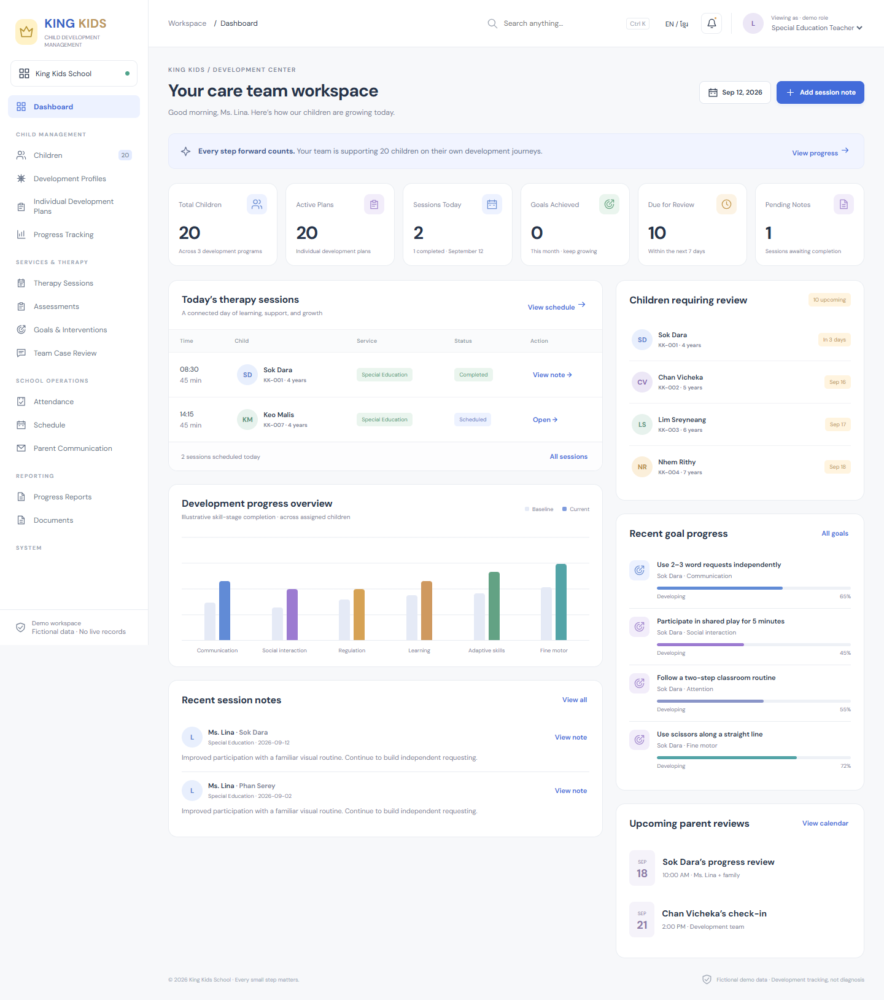

**Role purpose:** Records classroom learning, participation and development support for visible assigned children.

**Dashboard and navigation:** Dashboard, Children, Development Profiles, Individual Development Plans, Progress Tracking, Therapy Sessions, Assessments, Goals & Interventions, Team Case Review, Attendance, Schedule, Parent Communication, Progress Reports and Documents.

**Daily tasks:** Open a child; update skill stages, plans or goals; add a Special Education session; record an observational review; mark attendance; add a communication log; review progress and reports.

**Data access:** The demo applies seeded assigned-child scope. In the current fictional seed, the Special Education Teacher is assigned to all 20 children.

**Limits:** Staff, Users & Roles, Activity Log, Settings and Development Analytics are hidden. This role has no real login or configurable permission management.

### C. Speech Therapist guide

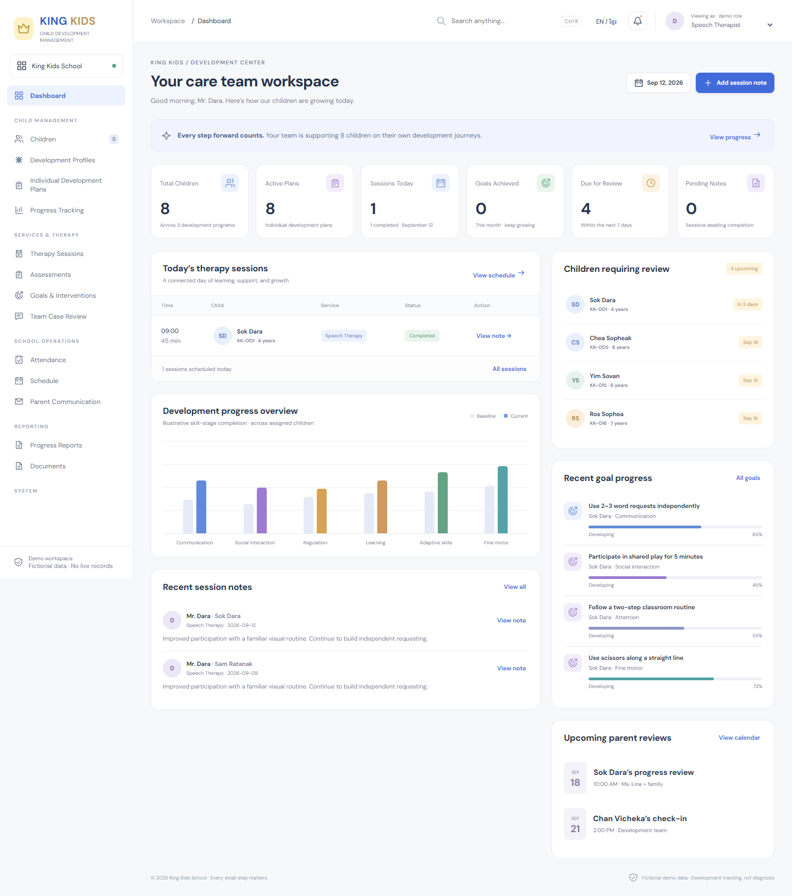

**Role purpose:** Records Speech Therapy work for seeded assigned children.

**Dashboard and navigation:** The same staff-role navigation as Special Education Teacher. The Sessions view is scoped to Speech Therapy sessions for visible assigned children.

**Daily tasks:** Review assigned children; update development skills and goals; add or edit Speech Therapy session records; enter observations, support, recommendations and parent-approved notes; review progress reports.

**Data access:** Eight seeded assigned children in the initial demo data; Speech Therapy session scope.

**Limits:** Administrative-only modules are hidden. The demo does not enforce communication-domain-only editing for this role.

### D. Occupational Therapist guide

**Role purpose:** Records Occupational Therapy work for seeded assigned children.

**Dashboard and navigation:** The same staff-role navigation as Special Education Teacher. Sessions are scoped to Occupational Therapy for visible assigned children.

**Daily tasks:** Review skills/goals, add or edit OT session notes, update observations and recommendations, track attendance, join team reviews and review reports.

**Data access:** Eight seeded assigned children in the initial demo data.

**Limits:** Administrative-only modules are hidden. The interface does not restrict editing only to Fine Motor, Sensory or Adaptive domains.

### E. Psychologist guide

**Role purpose:** Records Psychology observations and sessions for seeded assigned children.

**Dashboard and navigation:** The same staff-role navigation as Special Education Teacher. Sessions are scoped to Psychology for visible assigned children.

**Daily tasks:** Review development information, add Psychology session notes, assessments, goals, team-review entries, progress notes and recommendations.

**Data access:** Nine seeded assigned children in the initial demo data.

**Limits:** Administrative-only modules are hidden. Sensitive-note restrictions are displayed only as a demo convention; there is no separate confidential-note permission control.

### F. Physical Therapist guide

**Role purpose:** Records Physical Therapy work for seeded assigned children.

**Dashboard and navigation:** The same staff-role navigation as Special Education Teacher. Sessions are scoped to Physical Therapy for visible assigned children.

**Daily tasks:** Review development information, add Physical Therapy session notes, update goals/progress/recommendations, record attendance and participate in team reviews.

**Data access:** Nine seeded assigned children in the initial demo data.

**Limits:** Administrative-only modules are hidden. The interface does not restrict editing only to Gross Motor / Physical Development.

### G. Parent guide

**Role purpose:** Demonstrates a simplified family-facing view of one child.

**Dashboard and navigation:** Parent Overview, Goals, Progress, Sessions and Progress Reports only.

**Daily tasks:** Review the child’s development summary, shared goals, current progress, upcoming sessions, approved notes, home recommendations and report.

**Data access:** Parent View is fixed to fictional child Sok Dara. It shows approved session-note content only.

**Limits:** No editing controls; no Children directory; no internal staff notes, administrative modules, settings, analytics or activity history. This is actual screen access in the demo, but it is a visual simulation rather than a real parent account or communication-only feature.

## 5. Role access at a glance

| Role | Modules visible | Session scope | Edit actions shown | Main limitations |
|---|---|---|---|---|
| Director / Administrator | All 19 primary modules | All seeded sessions | Plans, skills, goals, sessions, assessments, attendance, communications, documents and settings | No real accounts, backend or record deletion |
| Special Education Teacher | 14 staff modules | Special Education | Shared development actions and own service sessions | Admin modules hidden |
| Speech Therapist | 14 staff modules | Speech Therapy | Shared development actions and own service sessions | Admin modules hidden; no domain-only restriction |
| Occupational Therapist | 14 staff modules | Occupational Therapy | Shared development actions and own service sessions | Admin modules hidden; no domain-only restriction |
| Psychologist | 14 staff modules | Psychology | Shared development actions and own service sessions | No separate confidential-note control |
| Physical Therapist | 14 staff modules | Physical Therapy | Shared development actions and own service sessions | Admin modules hidden; no domain-only restriction |
| Parent | 5 parent modules | Visible session information for Sok Dara | None | One fictional child; approved notes only |

## 6. Demo boundaries

- All child, guardian, staff, schedule and report information is fictional.
- Changes save in the current browser using localStorage when available.
- There is no backend database, real authentication, online messaging, payment service, clinical diagnosis function or real file upload.
- Browser Print / Save as PDF is used for report PDF output.
- The demo uses English as primary language with Khmer coverage for key navigation and labels.
